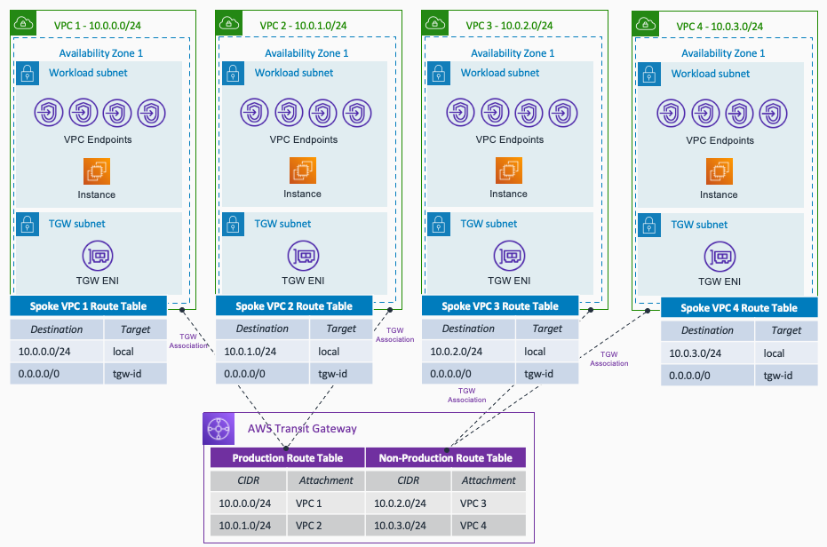

# AWS Hub and Spoke Architecture with Traffic Segmentation - Terraform

This repository contains terraform code to deploy a sample AWS Hub and Spoke architecture with production and non-production VPC, so you can see how traffic segmentation is achieved using several Transit Gateway Route Tables. The following resources are created by default:

- 4 VPCs: 2 Production and 2 Non-Production. Following AWS best pratices, VPC flow logs are activated (by default sent to CloudWatch logs). The logs are encrypted at rest with KMS (keys created in the *iam_kms* module).
- AWS Transit Gateway, and 2 Transit Gateway Route Tables (prod and non_prod). VPC attachments are associated and propagated to the corresponding TGW Route Table depending the "type" of VPC indicated in the *variables.tf* file.
- VPC Endpoints (ssm, ssmmessages, ec2messages and s3) deployed in each VPC - endpoints decentralized.
- EC2 instances. To follow best practices, these instances are accessed using AWS Systems Manager - via the VPC endpoints.
- Security Groups for the EC2 instances and VPC endpoints. The configuration of the SGs can be found in the *locals.tf* file.
- IAM Roles for CloudWatch access (VPC flow logs) and the SSM/S3 access by the EC2 instances.

The resources deployed and the architectural pattern they follow is purely for demonstration/testing purposes.

## Prerequisites

- An AWS account with an IAM user with the appropriate permissions
- Terraform installed

## Code Principles:

- Writing DRY (Do No Repeat Yourself) code using a modular design pattern

## Architecture

## Usage

- Clone the repository
- Edit the *variables.tf* file in the project root directory. This file contains the variables that are used to configure the VPCs to create.
- To change the configuration about the Security Groups and VPC endpoints to create, edit the *locals.tf* file in the project root directory.
- Initialize Terraform using `terraform init`.
- To start deploying the infrastructure, you need to create the VPCs before any other resource (due to some dependency constraint in other module). For that reason use `terraform apply -target="module.vpc_module"`.
- Now you can deploy the rest of the infrastructure using `terraform apply`.

**Note** The default number of Availability Zones to use in the VPCs is 1. To follow best practices, each resource - EC2 instance, and VPC endpoints - will be created in each Availability Zone. **Keep this in mind** to avoid extra costs unless you are happy to deploy more resources and accept additional costs.