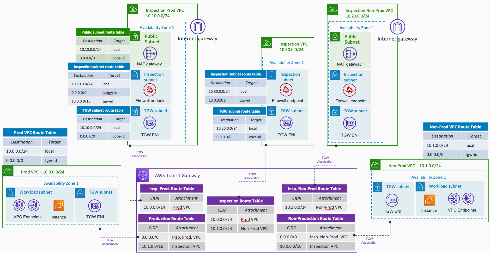

# AWS Hub and Spoke Architecture with Traffic Segmentation - Terraform

This repository contains terraform code to deploy a sample AWS Hub and Spoke architecture with production and non-production VPCs, with traffic inspection. The following resources are created by default:

- 5 VPCs: 1 Production, 1 Non-Production, and 3 Inspection VPCs (production, non-production, and cross-segments). Following AWS best pratices, VPC flow logs are activated (by default sent to CloudWatch logs). The logs are encrypted at rest with KMS (keys created in the *iam_kms* module).
- AWS Transit Gateway, and 5 Transit Gateway Route Tables (prod, non_prod, inspection_prod, inspection_non_prod, and inspection). VPC attachments are associated and propagated to the corresponding TGW Route Table depending the "type" of VPC indicated in the *locals.tf* file. If you decide to not any of the Inspection VPCs, propagations and static routes are created accordingly to achieve routing.
- VPC Endpoints (ssm, ssmmessages, ec2messages and s3) deployed in each spoke VPC - endpoints decentralized.
- EC2 instances in each spoke VPC. To follow best practices, these instances are accessed using AWS Systems Manager - via the VPC endpoints.
- Security Groups for the EC2 instances and VPC endpoints. The configuration of the SGs can be found in the *locals.tf* file.
- AWS Network Firewall - one per Inspection VPC created. In the *firewall_policy.tf* file you can check the different rules configuration per each firewall.
- IAM Roles for CloudWatch access (VPC flow logs) and the SSM/S3 access by the EC2 instances.

The resources deployed and the architectural pattern they follow is purely for demonstration/testing purposes. Take into account that 5 VPCs are created by default trying to not reach the default quota of 5 VPCs per AWS Region. If you have increased your quota and want to add more Spoke VPCs in the example, do it in the *locals.tf* file.

## Prerequisites

- An AWS account with an IAM user with the appropriate permissions
- Terraform installed

## Code Principles:

- Writing DRY (Do No Repeat Yourself) code using a modular design pattern

## Architecture

## Usage

- Clone the repository
- Edit the *variables.tf* file (in the root directory) to configure the AWS Region to use, the project identifier, and the number of Availability Zones to use. Edit the *locals.tf* (in the root directory) to configure the VPCs to create.
- To change the configuration about the Security Groups and VPC endpoints to create, edit the *locals.tf* file in the project root directory.
- Initialize Terraform using `terraform init`.
- Now you can deploy the rest of the infrastructure using `terraform apply`.
- To delete everything, use `terraform destroy`.

**Note** The default number of Availability Zones to use in the VPCs is 1. To follow best practices, each resource - EC2 instance, and VPC endpoints - will be created in each Availability Zone. **Keep this in mind** to avoid extra costs unless you are happy to deploy more resources and accept additional costs.